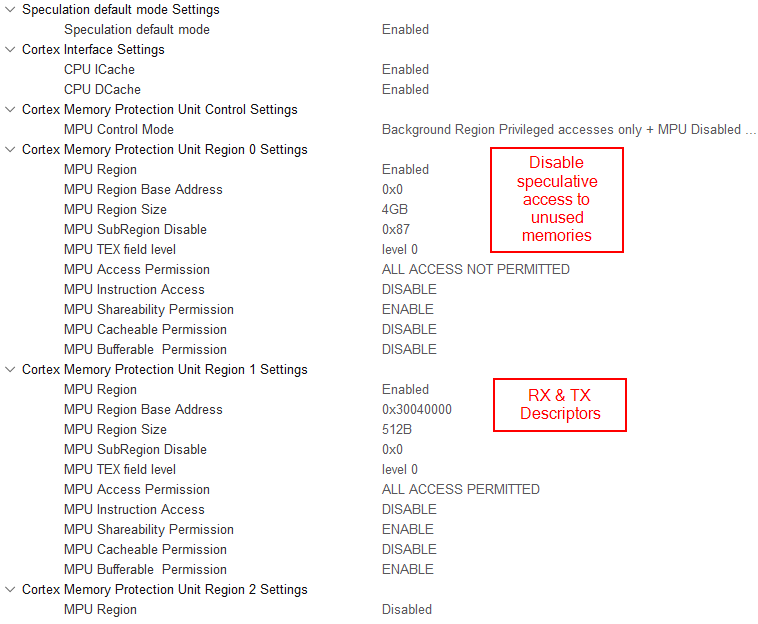

# STM32H7 STM32CubeMX based Ethernet examples

*This readme is intended for STM32CubeIDE version 1.18.1 and STM32CubeH7 version 1.12.1. For older tool versions please see older version of this readme in the repository*

Simple Ethernet examples based on LwIP and FreeRTOS, running on ST Nucleo and Discovery boards.
These examples are provided to accompany the [FAQ article on ST community][faq].
The same how to step-by-step is also provided [below](#how-to-create-project-from-scratch)

## Features
* Fixed IP address 192.168.1.10
* The code should work even when regenerating the code in STM32CubeMX
* Changes in code can be found by searching for the `ETH_CODE` keyword

## Release notes

| Version | STM32CubeIDE version | STM32CubeH7 version | Description / Update | Date |
|--:|--:|--:|--|--:|
| [1.3](https://github.com/stm32-hotspot/STM32H7-LwIP-Examples/tree/v1.3_ide_v1.18.1) | 1.18.1 | 1.12.1 | Ported to new IDE/library version. Change configuration to use cache maintenance. Fixed iperf code. | August 19<sup>th</sup> 2026 |
| [1.2](https://github.com/stm32-hotspot/STM32H7-LwIP-Examples/tree/v1.2_ide_v1.9.0) | 1.9.0 | 1.10.0 | Ported to new IDE/library version. Ethernet driver reworked in new library release. Added iperf measurement and TCP/IP settings tuned. Published on Github | August 9<sup>th</sup> 2022 |
| [1.1](https://github.com/stm32-hotspot/STM32H7-LwIP-Examples/tree/v1.1_ide_v1.6.1) | 1.6.1 | 1.9.0 | Added Cortex-M4 base examples | July 19<sup>th</sup> 2021 |
| [1.0](https://github.com/stm32-hotspot/STM32H7-LwIP-Examples/tree/v1.0_ide_v1.6.1) | 1.6.1 | 1.9.0 | Initial release on ST community (with minor changes on Github) | June 21<sup>st</sup> 2021 |

Using GIT tags it should be easy to find examples for particular version of STM32CubeIDE and HAL library

## TCP/IP configuration in LwIP

The configuration below is necessary to achieve good TCP/IP performance

|Parameter|Value|Formula|Needs to be changed in MX|
|:-|-:|-:|-:|
| TCP_MSS | 1460 | `1500-40`| **yes** |
| TCP_SND_BUF | 5840 | `4 * TCP_MSS` | **yes** |
| TCP_WND | 5840 | `4 * TCP_MSS` | no |
| TCP_SND_QUEUELEN | 16 | `UPPER((4 * TCP_SND_BUF) / TCP_MSS)` |  **yes** | 

## Memory layout

On STM32H74x/H75x devices, all data related to Ethernet and LwIP are placed in D2 SRAM memory (288 kB).
The first 128 kB of this memory are reserved for Cortex®-M4 on dual-core devices. On single core devices, this part can be used for other purposes.

| Variable | STM32H74x/H75x address | Cortex-M4 alias | Size | Source file |
|:-|-:|-:|-:|-:|
|DMARxDscrTab|0x30040000|0x10040000|96 (256 max.)|ethernetif.c|
|DMATxDscrTab|0x30040100|0x10040100|96 (256 max.)|ethernetif.c|
|memp_memory_RX_POOL_base|0x30040200|0x10040200|12*(1536 + 24)|ethernetif.c|
|LwIP heap|0x30020000|0x10020000|131040 (128kB - 32[^3])|lwipopts.h|


For STM32H72x/H73x devices, the D2 SRAM is more limited (only 32 kB). The Rx buffers need to be placed in AXI SRAM, since they do not fit to D2 RAM, together with LwIP heap.
The LwIP heap is reduced to fit the rest of D2 RAM together with DMA descriptors.

| Variable | STM32H72x/H73x address | Size | Source file |
|:-|-:|-:|-:|
|DMARxDscrTab|0x30000000|96 (256 max.)|ethernetif.c|
|DMATxDscrTab|0x30000100|96 (256 max.)|ethernetif.c|
|memp_memory_RX_POOL_base|AXI SRAM (32-byte aligned)|12*(1536 + 24)|ethernetif.c|
|LwIP heap|0x30000200|32224 (32kB - 512 - 32[^3])|lwipopts.h|

*The values provided here are an example of implementation. Other configurations are also possible to optimize memory usage. When changing the memory layout, the MPU configuration needs to be updated accordingly.*

For performance, it is better to keep packet buffers cacheable and manage memory coherency through cache maintenance operations.
This means that the packet buffers need to be aligned to 32- bytes (the size of cache line). In LwIP, the pbuf struct contains both packet buffer and additional metadata.

To force alignment of 32-bytes between metadata and packet buffer the, MEM_ALIGNMENT option needs to be configured properly.
For RX, the packet buffer should be invalidated both before and after the reception. This is to avoid corrupting data by cache line eviction.

## License

Libraries and middleware is taken from [STM32CubeH7 package][cubeh7]. The same licenses apply to these examples. There is minimum code added on top of STM32CubeMX and HAL libraries, this code is provided AS-IS.

# How to create project from scratch

## Goal of the example

Goal of this example is to:

* Configure project in STM32CubeMX for STM32H750-Discovery
* Configure FreeRTOS™ and LwIP middlewares correctly
* Send a UDP message periodically (optional)

Although the example is using STM32H750-Discovery, use the same steps for other STM32H7 based boards. The main differences are usually pinout and clock configuration. You might also need to check board solder bridges to make sure that the Ethernet is connected to the MCU.

## STM32CubeMX project configuration

* Create new project in STM32CubeMX, select STM32H750-Discovery board and select "No" to "Initialize all peripherals in default mode?" pop-up.
	* This will help with pin assignment.

## Basic configuration

Configure clock tree:

* In pinout/RCC configure HSE in bypass mode
* In the clock tree, configure 400 MHz for the core.


* In pinout/SYS, configure a different timebase than SysTick (recommended when using FreeRTOS™)
	* TIM6 is usually a good option, since it is a simple timer

## Ethernet configuration

* Enable Ethernet peripheral in pinout view in MII mode (MII used on the board).
* Enable Ethernet interrupt and set preemption priority to 5. This is required by FreeRTOS™ to call its functions from the interrupt handler.
* Relocate Ethernet CRS and COL signals from PH2/PH3 to PA0/PA3
	* These signals are optional in full-duplex mode and not connected in default configuration
	* This also allows using PH2/PH3 for QSPI.
* Other pins should be correctly placed, since we create the project from the board selector.


* Set the GPIO pin speed to "Very High".


​

_The ETH_MDC speed could not be changed, but it does not affect the application and is fixed in new versions._

## Cortex®-M7 configuration
This step can be skipped when using a Cortex®-M4 core.

* Enable ICache and DCache.
* Enable memory protection unit (MPU) in "Background Region Privileged access only + MPU. Disabled ..." mode. Configure regions according to the picture below:



*The example above is intended for the STM32H743 device. For other devices or Cortex®-M4 core on dual-core devices, different addresses and size might be necessary. Please refer to the section [Memory layout](#memory-layout)*

*When using a dual-core device and running Ethernet on Cortex®-M7 core, ensure that memory used by Ethernet is not used by Cortex®-M4. Also note that the Cortex®-M4 can use a different address alias for D2 RAM*

## FreeRTOS™ configuration

* Enable the FreeRTOS™ with CMSIS_V1 API.
* Increase the size of the defaultTask stack to 512 words[^1].
* Lower stack values cause memory corruptions.
* Check that the generated code is correct, since there is a bug when increasing the MINIMAL_STACK_SIZE.
* There might be an old value in the code (this should be fixed in new versions).


## LwIP configuration

* Enable LwIP in the middleware.
* In the "General settings" tab, disable the DHCP server and configure the fixed IP address (unless you know how to configure and use DHCP).


* In the attached examples, the 192.168.1.10 IP address is used (instead of 192.168.0.10 shown on the screenshot).
* In the "Platform settings" tab, select "LAN8742" in both boxes. The LAN8742 driver is also compatible with LAN8740 device, which is present on the STM32H750-Discovery board. The main difference between these devices is the support of the MII interface. On other boards, the LAN8742 PHY chip is used.


In the "Key options" tab:

* Select "Show Advanced Parameters" in the top-right corner. This is required for MEM_ALIGNMENT configuration.
* Configure MEM_ALIGNMENT to 32 bytes. This is the size of cache line and this is needed for proper cache maintenance of LwIP buffers.
* Configure MEM_SIZE to 16352 = 16 KB minus 32 bytes for allocator metadata[^3]. This specifies the heap size, which we relocated to D2 SRAM.
* Also enable LWIP_NETIF_LINK_CALLBACK (needed for cable plugging/unplugging detection).
* Set the LWIP_RAM_HEAP_POINTER to the proper address[^2].
* Set the MEM_SIZE parameter to the proper size[^2].


* In the "Checksum" tab enable CHECKSUM_BY_HARDWARE. Other options should automatically reconfigure and you can leave them in this state.


## Generate the project

Save the project to a folder of your selection. Now, you can generate the project for IDE. We use STM32CubeIDE in this example, but it should work with other IDEs.

## Modifying the code (STM32CubeIDE)
There are several places where some additional code should be placed, also depending on the selected device. In the examples, all these places are marked with a comment containing `ETH_CODE` along with a basic explanation. Searching for `ETH_CODE` can show all these places.

The main points are mentioned below:

* Placement of the RX_POOL buffers (although we configured the address in CubeMX) in ethernetif.c[^2]:
```c
/* USER CODE BEGIN 2 */
#if defined ( __ICCARM__ ) /*!< IAR Compiler */
#pragma location = 0x30040200
extern u8_t memp_memory_RX_POOL_base[];

#elif defined ( __CC_ARM )  /* MDK ARM Compiler */
__attribute__((at(0x30040200)) extern u8_t memp_memory_RX_POOL_base[];

#elif defined ( __GNUC__ ) /* GNU Compiler */
__attribute__((section(".Rx_PoolSection"))) extern u8_t memp_memory_RX_POOL_base[];

#endif
/* USER CODE END 2 */
```
* In STM32CubeIDE v1.9.0 ,the GCC was updated to version 10. This changes the default handling of COMMON sections (https://gcc.gnu.org/gcc-10/changes.html). This can lead to compilation errors with the errno variable being defined multiple times. This can happen when FreeRTOS™ and LwIP are enabled. To work around this issue,  put the following code in lwipopts.h (https://github.com/STMicroelectronics/stm32_mw_lwip/issues/1 ):
```c
/* USER CODE BEGIN 1 */
#undef LWIP_PROVIDE_ERRNO
#define LWIP_ERRNO_STDINCLUDE
/* USER CODE END 1 */
```
* Add DATA_IN_D2_SRAM to the macro definitions in the project: 


### Modify the linker script (not valid for Keil/IAR)[^2]
This step should be skipped for Keil® and IAR, since they support placing variables at specific address in C code.
Modify the linker script (*.ld) so that the ETH descriptors and buffers are located in D2 SRAM.

It is recommended to place all RAM to RAM_D1. In STM32CubeMX generated project, the "_FLASH" suffix linker script should be modified, which is used by default (for example, the STM32H750XBHx_FLASH.ld file).

The "_RAM" suffix linker script is a template for executing code from internal RAM memory.
```ld
  } >RAM_D1

  /* Modification start */
  .lwip_sec (NOLOAD) :
  {
    . = ABSOLUTE(0x30040000);
    *(.RxDecripSection) 
    
    . = ABSOLUTE(0x30040060);
    *(.TxDecripSection)
    
    . = ABSOLUTE(0x30040200);
    *(.Rx_PoolSection)  
  } >RAM_D2
  /* Modification end */

  /* Remove information from the compiler libraries */
  /DISCARD/ :
  {
    libc.a ( * )
    libm.a ( * )
    libgcc.a ( * )
  }
```
The memory definitions at the beginning of the linker script should look like:

```ld
MEMORY
{
  FLASH (rx)     : ORIGIN = 0x08000000, LENGTH = 128K
  DTCMRAM (xrw)  : ORIGIN = 0x20000000, LENGTH = 128K
  RAM_D1 (xrw)   : ORIGIN = 0x24000000, LENGTH = 512K
  RAM_D2 (xrw)   : ORIGIN = 0x30000000, LENGTH = 288K
  RAM_D3 (xrw)   : ORIGIN = 0x38000000, LENGTH = 64K
  ITCMRAM (xrw)  : ORIGIN = 0x00000000, LENGTH = 64K
}
```
For dual-core devices, it is best to restrict the RAM_D2 section to avoid collision with Cortex®-M4. Refer to the linker scripts in examples.

### (Optional) Adding a simple "Hello UDP" message

* Add the following include files at the beginning of main.c:
```c
#include "lwip/udp.h"
#include <string.h>
```
* Modify the StartDefaultTask in main.c with the following code:
```c
/* USER CODE BEGIN 5 */
const char* message = "Hello UDP message!\n\r";

osDelay(1000);

ip_addr_t PC_IPADDR;
IP_ADDR4(&PC_IPADDR, 192, 168, 1, 1);

struct udp_pcb* my_udp = udp_new();
udp_connect(my_udp, &PC_IPADDR, 55151);
struct pbuf* udp_buffer = NULL;

/* Infinite loop */
for (;;) {
  osDelay(1000);
  /* !! PBUF_RAM is critical for correct operation !! */
  udp_buffer = pbuf_alloc(PBUF_TRANSPORT, strlen(message), PBUF_RAM);

  if (udp_buffer != NULL) {
    memcpy(udp_buffer->payload, message, strlen(message));
    udp_send(my_udp, udp_buffer);
    pbuf_free(udp_buffer);
  }
}
/* USER CODE END 5 */
```
Now, you should be able to ping the device and receive UDP messages. This assumes that you configure IP address 192.168.1.1 for the receiving device (the 192.168.1.0/24 network is used by attached examples). On Linux operating systems you can observe the messages with the following command:
```
netcat -ul 55151
```

### Tips & common mistakes

1. For STM32H72x/H73x devices, the Ethernet buffers cannot be placed in the address range 0x30040000 - 0x30048000, since that range is not valid. D2 SRAM on those devices is much smaller, so the buffers need to be placed starting at 0x30000000. This affects RX & TX descriptors and RX buffer addresses (ETH configuration in CubeMX) and LWIP_RAM_HEAP_POINTER used for TX buffers (LWIP > Key options in CubeMX).
1. When running the stack on Cortex-M4, the buffers can be placed at the same address (0x30040000), but it is better to place them at 0x10040000, which is the alias for the same address. This alias is accessible by Cortex®-M4 D-bus and helps to utilize the Harvard architecture.
1. When not using FreeRTOS™, the Ethernet interrupt should be disabled and MX_LWIP_Process should be called periodically (in the main loop).
1. On STM32H747-Discovery boards, modification needs to be done to the default solder bridge configuration. SB8 should be closed and SB21 should be open for Ethernet to work, otherwise the MDC signal is not properly connected.

When facing issues with your own project:

1. Try the example and see if there is a proper configuration on the PC side. With corporate firewalls and restrictions, it might be difficult to perform a simple ping to a specific IP address. In some cases, it is easier to test from a personal PC, or a PC with firewalls disabled.
1. Check if the Ethernet interrupt is called and if the RX callback is called
	* If not, GPIOs are set to proper speed (very high).
	* ETH global interrupt is enabled (only for FreeRTOS™)
		* Interrupt priority should be 5 - preemption and 0 - subpriority. This is required by the default FreeRTOS™ configuration.
1. If a Hardfault is called, the problem might be in the MPU configuration.
	* Check the values carefully (for example, a slight mistake like having "256KB" instead "256B" can make a significant difference) 
1. RX callback is called but pinging does not work. 
	* Check that the buffers are properly placed in the linker script (the one ending with "_FLASH.ld").
	* In STM32CubeIDE, you can use the "Build analyzer" window.
1. When allocating buffers via pbuf_alloc (or similar), PBUF_RAM must be used as the 3rd parameter. This is necessary to ensure that the allocated buffer is placed in D2 SRAM and synchronized with DMA
1. A nonsufficient stack size for a different thread can cause issues.
	* Enabling [stack overflow detection][freertos_stack] can help identify the issue.

## Questions and feedback

If you see any issue with these examples please fill an issue inside this repository. If you face difficulties, but are not sure if this is an issue you can discuss in the repository, or create a topic in our [product forums](https://community.st.com/product-forums-23)

[^1]: The exact size required for different stacks might depend on used compiler and optimization flags. The same goes for FreeRTOS™ heap size, since thread stacks are allocated from this heap.
[^2]: Some addresses and sizes depend on the device or core used. Please refer to section [Memory layout](#memory-layout).
[^3]: Allocator metadata needs to be subtracted from the MEM_SIZE. The allocator metadata actually takes only 24 bytes for big heaps (above 64000 bytes), or 12 bytes for small heaps . However, we also configure 32-byte alignment, so in both cases we need to substract 32 bytes.

[freertos_stack]: https://www.freertos.org/Stacks-and-stack-overflow-checking.html
[cubeh7]: https://github.com/STMicroelectronics/STM32CubeH7
[iperf]: https://iperf.fr/
[faq]: https://community.st.com/s/article/How-to-create-project-for-STM32H7-with-Ethernet-and-LwIP-stack-working